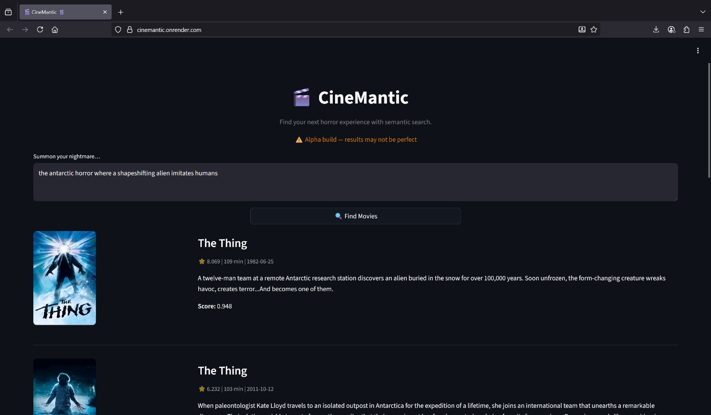

# 🎬👻 CineMantic – Semantic Horror Movie Finder  

CineMantic is a semantic search app for horror movies.  
Forget exact titles — just describe a scene, vibe, or memory (*“creepy haunted house with ghosts tormenting a family”*) and CineMantic finds the closest matches.  

 <!-- optional screenshot -->

---

## ✨ Features
- 🧠 **Semantic matching** that understands vibes, not just keywords  
- ⚡ **Fast retrieval** over the **Top 500 TMDB horror movies**  
- 🎬 Movie database with posters, ratings, runtime, and release dates  
- 🎨 Clean, responsive interface  
- Proper **TMDB attribution**  

---

## 🛠 Tech Stack
- **Python 3.12**  
- **Semantic embeddings + retrieval**  
- **Vector search backend**  
- **Lightweight movie database**  
- **Streamlit UI**  

---

🚧 **Status:** Alpha build — currently limited to the Top 500 TMDB horror titles.  